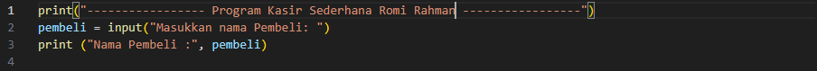
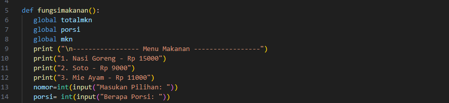
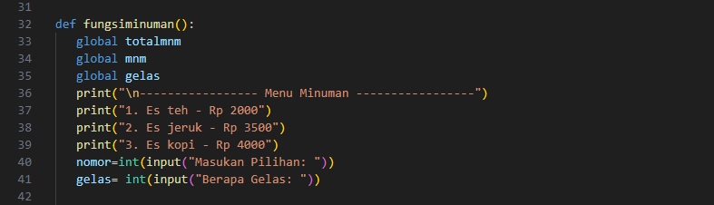
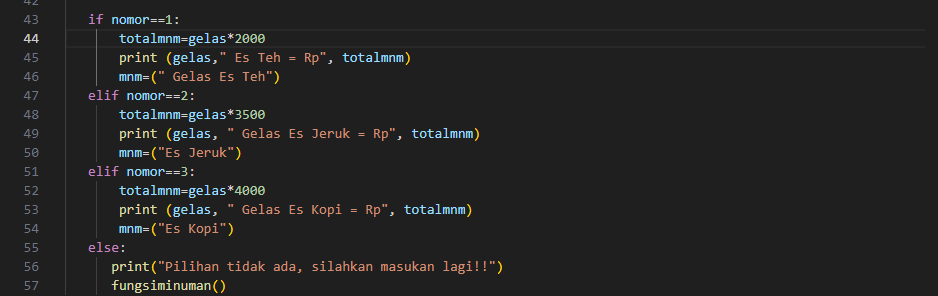
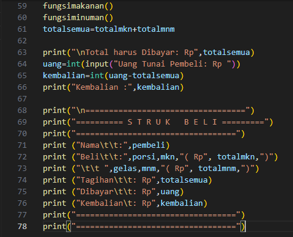
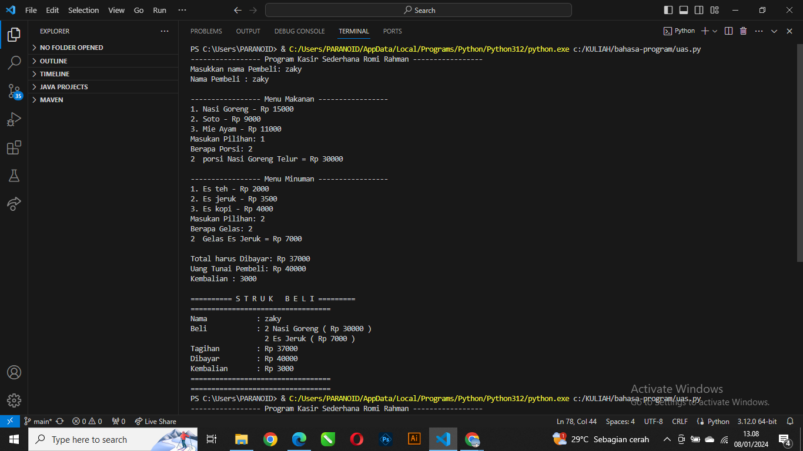

# program-kasir-uas

# Menu dan Harga:
program ini menjelaskan sebuah program yang digunakan oleh kasir di sebuah kantin untuk memesan makanan atau minuman,menghitung total pembelian,dan menampilkan struk pembelian. Berikut adalah penjelasan rinci dari setiap bagian program

# Fungsi Tampilan Menu & main
fungsi ini menampilkan menu makanan/minuman beserta harganya.
Fungsi main merupakan inti dari program.
Selama pengguna belum memilih 'sudah', program akan menampilkan menu dan meminta pengguna untuk memasukkan pesanan.
Jika pesanan valid, program akan menyimpan pesanan beserta jumlah dan total harga dalam dictionary pesanan.
Setelah pengguna selesai memesan, program akan menampilkan struk pembelian menggunakan PrettyTable, mencetak menu, jumlah, dan harga total setiap pesanan, serta total pembelian keseluruhan

# Fungsi Hitung total
fungsi ini menghitung total harga satuan dan jumlah yang dipesan.

# Hasil Run

